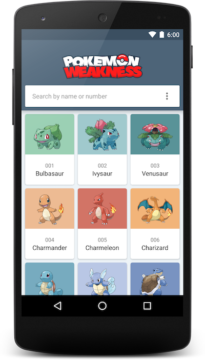

# Pokémon Weakness for Android

This is the source code for the Pokemon Weakness' Android application



<a href='https://betas.to/KuPrR8Tu'></a>

### License

```
Copyright 2016 Rafa Vázquez

Licensed under the Apache License, Version 2.0 (the "License");
you may not use this file except in compliance with the License.
You may obtain a copy of the License at

   http://www.apache.org/licenses/LICENSE-2.0

Unless required by applicable law or agreed to in writing, software
distributed under the License is distributed on an "AS IS" BASIS,
WITHOUT WARRANTIES OR CONDITIONS OF ANY KIND, either express or implied.
See the License for the specific language governing permissions and
limitations under the License.
```